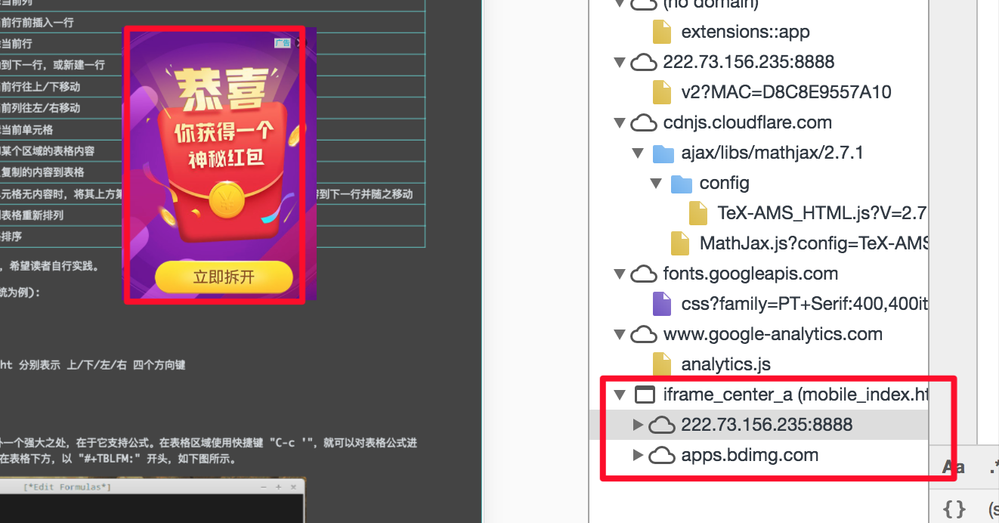
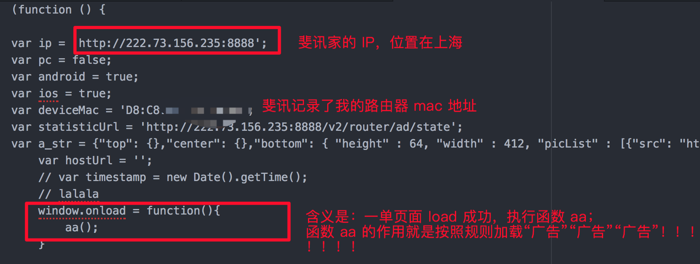

#+TITLE: 天了噜，这家家庭路由器厂商竟然这么干

|     date | modification |
|----------+--------------|
| 20180319 | first commit |

** 起因
最近网上浏览网页时总是概率性“广告”弹窗，一开始以为是网站的问题吧；后来频繁出现，
觉得事情有点不对。

** 分析
联想到前两天给 chrome 浏览器安装了几个额外的插件、升级了proxy 插件，担心因为无良
插件作者搞的鬼，先顺次删除了最近安装的插件。结果依然存在广告弹窗。感觉这个事情
不简单。

经过深入分析，发现竟然是家用路由器劫持了 HTTP 流量所致（斐讯 K2路由器）。每当我
访问 HTTP 流量时，斐讯路由器在返回的页面中插入一段 js 代码，这段 js 代码监听浏览
器 onload 事件，根据用户的访问形式以及后台设计的规则推送广告。

证据大致分析：
1. 通过 github 下载 pages 源文件，与直接访问的http文件，多了一行 script 标签。
2. script 标签内为 js 文件
3. js 文件中的诸多逻辑可以表示跟路由器有关：
   - 比如js 文件中有我路由器的 device address;
   - 比如 js 文件单独对 baidu、phicomm.com(斐讯域名)进行广告屏蔽;
   - 比如 js 文件中 url 连接中IP 地址正是路由器厂商公司所在地，存在明显的 route 标记。

** 结尾
竟然“劫持”这件事距离我这么近~；一直以为只有 Baidu、淘宝这类大站大家更加关注，没
想到....站长们，尽快拥抱 HTTPS 吧

后来此事向厂商反馈，对方也没有积极跟进，只是说“我们加路由器不可能侵犯用户隐私”。
再后来，发现这个问题已经有网友在[[http://www.phiwifi.cn/thread/6360][斐讯社区（它家门口）]]反映过，依然没有官方人员出来
应对此事。

看来，我们国人的隐私真的是可以用来“探索”的，而且不用付法律责任。

** 图一：广告 frame 对应的广告请求（红框与广告元素对应）

** 图二：插入的 js 代码核心逻辑

附件：[[./attach/feixun.js][斐讯路由器的劫持JS代码]]
